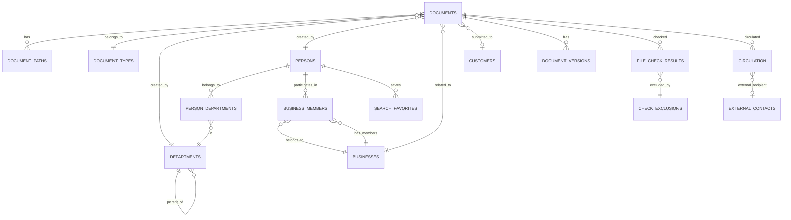

# ドキュメント管理システム 設計書

## 1. システム概要

### 1.1 アーキテクチャ概要

```text
[Web Browser] 
      ↓ HTTPS
[Reverse Proxy/Load Balancer]
      ↓
[Axum Web Server]
      ↓
[Diesel ORM]
      ↓
[SQLite Database] ←→ [File System Check Service]
      ↓                        ↓
[Network Drive] ←────────────── [Notification Service]
                                ↓
                          [Email/Teams API]
```

### 1.2 技術スタック選定根拠

| コンポーネント    | 選定技術               | 選定理由                               |
| ----------------- | ---------------------- | -------------------------------------- |
| **Web Framework** | Axum                   | 高性能・型安全・非同期処理対応         |
| **ORM**           | Diesel                 | コンパイル時型チェック・SQLite対応     |
| **Database**      | SQLite                 | 軽量・ファイルベース・メンテナンス不要 |
| **Frontend**      | HTML/CSS/JS            | シンプル・保守性重視・学習コスト最小   |
| **Auth**          | Windows Authentication | AD統合・既存インフラ活用               |
| **Notification**  | webhook/SMTP           | Teams/Exchange連携                     |

### 1.3 システム構成要件

- **同時接続**: 最大10ユーザー
- **レスポンス**: 2秒以内
- **可用性**: 平日8-18時 99%
- **データ容量**: 100万件規模対応

## 2. データ設計

### 2.1 概念データモデル（ER図）



### 2.2 物理データモデル

#### 2.2.1 文書種別マスタ (document_types)

| Column            | Type        | Constraint      | Description               |
| ----------------- | ----------- | --------------- | ------------------------- |
| id                | INTEGER     | PRIMARY KEY     | 文書種別ID                |
| code              | VARCHAR(1)  | UNIQUE NOT NULL | 種別コード(A,B,C,D,Q,R,X) |
| name              | VARCHAR(50) | NOT NULL        | 種別名                    |
| requires_approval | BOOLEAN     | DEFAULT FALSE   | 承認書要否フラグ          |
| created_at        | TIMESTAMP   | DEFAULT NOW     | 作成日時                  |
| updated_at        | TIMESTAMP   | DEFAULT NOW     | 更新日時                  |

#### 2.2.2 部署マスタ (departments)

| Column     | Type         | Constraint      | Description           |
| ---------- | ------------ | --------------- | --------------------- |
| id         | INTEGER      | PRIMARY KEY     | 部署ID                |
| code       | VARCHAR(10)  | UNIQUE NOT NULL | 部署コード            |
| name       | VARCHAR(100) | NOT NULL        | 部署名                |
| parent_id  | INTEGER      | FOREIGN KEY     | 親部署ID              |
| level      | INTEGER      | NOT NULL        | 階層レベル(1:部,2:課) |
| valid_from | DATE         | NOT NULL        | 有効開始日            |
| valid_to   | DATE         | NULL            | 有効終了日            |
| created_at | TIMESTAMP    | DEFAULT NOW     | 作成日時              |
| updated_at | TIMESTAMP    | DEFAULT NOW     | 更新日時              |

#### 2.2.3 人員マスタ (persons)

| Column      | Type         | Constraint      | Description    |
| ----------- | ------------ | --------------- | -------------- |
| id          | INTEGER      | PRIMARY KEY     | 人員ID         |
| employee_id | VARCHAR(20)  | UNIQUE NOT NULL | 社員番号       |
| name        | VARCHAR(100) | NOT NULL        | 氏名           |
| email       | VARCHAR(100) | UNIQUE          | メールアドレス |
| ad_username | VARCHAR(50)  | UNIQUE          | ADユーザー名   |
| is_active   | BOOLEAN      | DEFAULT TRUE    | 在職フラグ     |
| created_at  | TIMESTAMP    | DEFAULT NOW     | 作成日時       |
| updated_at  | TIMESTAMP    | DEFAULT NOW     | 更新日時       |

#### 2.2.4 人員所属履歴 (person_departments)

| Column          | Type        | Constraint     | Description               |
| --------------- | ----------- | -------------- | ------------------------- |
| id              | INTEGER     | PRIMARY KEY    | 履歴ID                    |
| person_id       | INTEGER     | FOREIGN KEY    | 人員ID                    |
| department_id   | INTEGER     | FOREIGN KEY    | 部署ID                    |
| role            | VARCHAR(50) | NULL           | 役職                      |
| assignment_type | VARCHAR(20) | DEFAULT 'main' | 所属種別(main/concurrent) |
| valid_from      | DATE        | NOT NULL       | 所属開始日                |
| valid_to        | DATE        | NULL           | 所属終了日                |
| created_at      | TIMESTAMP   | DEFAULT NOW    | 作成日時                  |

#### 2.2.5 業務マスタ (businesses)

| Column          | Type         | Constraint  | Description  |
| --------------- | ------------ | ----------- | ------------ |
| id              | INTEGER      | PRIMARY KEY | 業務ID       |
| business_number | VARCHAR(20)  | NOT NULL    | 業務番号     |
| name            | VARCHAR(200) | NOT NULL    | 業務名       |
| period_from     | DATE         | NOT NULL    | 業務期間開始 |
| period_to       | DATE         | NULL        | 業務期間終了 |
| created_at      | TIMESTAMP    | DEFAULT NOW | 作成日時     |
| updated_at      | TIMESTAMP    | DEFAULT NOW | 更新日時     |

**Index**: UNIQUE(business_number, period_from) -- 業務番号と期間の組み合わせで一意

#### 2.2.6 顧客マスタ (customers)

| Column          | Type         | Constraint        | Description                  |
| --------------- | ------------ | ----------------- | ---------------------------- |
| id              | INTEGER      | PRIMARY KEY       | 顧客ID                       |
| name            | VARCHAR(200) | NOT NULL          | 顧客名                       |
| normalized_name | VARCHAR(200) | NULL              | 正規化名                     |
| customer_type   | VARCHAR(20)  | DEFAULT 'company' | 顧客種別(company/individual) |
| contact_info    | TEXT         | NULL              | 連絡先情報(JSON)             |
| is_active       | BOOLEAN      | DEFAULT TRUE      | 有効フラグ                   |
| created_at      | TIMESTAMP    | DEFAULT NOW       | 作成日時                     |
| updated_at      | TIMESTAMP    | DEFAULT NOW       | 更新日時                     |

#### 2.2.7 文書マスタ (documents)

| Column                       | Type         | Constraint             | Description          |
| ---------------------------- | ------------ | ---------------------- | -------------------- |
| id                           | INTEGER      | PRIMARY KEY            | 文書ID               |
| document_number              | VARCHAR(50)  | UNIQUE NOT NULL        | 文書番号（生成結果） |
| title                        | VARCHAR(500) | NOT NULL               | 文書タイトル         |
| document_type_id             | INTEGER      | FOREIGN KEY            | 文書種別ID           |
| department_id                | INTEGER      | FOREIGN KEY            | 作成部署ID           |
| creator_id                   | INTEGER      | FOREIGN KEY            | 作成者ID             |
| business_id                  | INTEGER      | FOREIGN KEY            | 業務ID               |
| customer_id                  | INTEGER      | FOREIGN KEY            | 顧客ID               |
| confidentiality_level        | VARCHAR(20)  | DEFAULT 'internal_low' | 機密レベル           |
| document_number_rule_id      | INTEGER      | FOREIGN KEY            | 文書番号生成ルールID |
| document_number_is_exception | BOOLEAN      | DEFAULT FALSE          | 例外番号フラグ       |
| created_date                 | DATE         | NOT NULL               | 作成日               |
| created_at                   | TIMESTAMP    | DEFAULT NOW            | 登録日時             |
| updated_at                   | TIMESTAMP    | DEFAULT NOW            | 更新日時             |

**機密レベル**: internal_low, internal_high, external_low, external_high

**文書番号生成について**:

- `document_number`: ルールベース生成結果または例外指定番号を格納
- `document_number_rule_id`: 適用された生成ルールを参照（例外の場合はNULL）
- `document_number_is_exception`: TRUE の場合は手動指定番号、FALSE の場合はルール生成

#### 2.2.8 文書版管理 (document_versions)

| Column         | Type        | Constraint    | Description          |
| -------------- | ----------- | ------------- | -------------------- |
| id             | INTEGER     | PRIMARY KEY   | 版ID                 |
| document_id    | INTEGER     | FOREIGN KEY   | 文書ID               |
| version_type   | VARCHAR(10) | NOT NULL      | 版種別(r/d)          |
| version_number | INTEGER     | NOT NULL      | 版番号               |
| full_version   | VARCHAR(20) | NOT NULL      | 完全版番号(例:r1,d2) |
| is_current     | BOOLEAN     | DEFAULT FALSE | 最新版フラグ         |
| created_at     | TIMESTAMP   | DEFAULT NOW   | 作成日時             |

**Index**: UNIQUE(document_id, version_type, version_number)

#### 2.2.9 文書番号生成ルール (document_number_generation_rules)

| Column             | Type         | Constraint    | Description              |
| ------------------ | ------------ | ------------- | ------------------------ |
| id                 | INTEGER      | PRIMARY KEY   | ルールID                 |
| rule_name          | VARCHAR(100) | NOT NULL      | ルール名                 |
| document_types     | TEXT         | NULL          | 対象文書種別(JSON)       |
| departments        | TEXT         | NULL          | 対象部署(JSON)           |
| creation_date_from | DATE         | NULL          | 文書作成日範囲(開始)     |
| creation_date_to   | DATE         | NULL          | 文書作成日範囲(終了)     |
| rule_valid_from    | DATE         | NOT NULL      | ルール有効期間(開始)     |
| rule_valid_to      | DATE         | NULL          | ルール有効期間(終了)     |
| number_template    | VARCHAR(100) | NOT NULL      | 番号テンプレート         |
| sequence_format    | VARCHAR(20)  | DEFAULT '001' | 連番フォーマット         |
| include_month      | BOOLEAN      | DEFAULT TRUE  | 月表記有無               |
| year_format        | VARCHAR(10)  | DEFAULT 'YY'  | 年フォーマット(YY/YYYY)  |
| priority           | INTEGER      | DEFAULT 100   | 優先度(小さいほど高優先) |
| is_active          | BOOLEAN      | DEFAULT TRUE  | 有効フラグ               |
| description        | TEXT         | NULL          | 説明                     |
| created_at         | TIMESTAMP    | DEFAULT NOW   | 作成日時                 |

**番号テンプレート例**: `{document_type}{department}{year}{month?}{sequence}`
**実例**: `CTA2508001`, `DA25001` (月なし), `稟議-25001` (月なし)

#### 2.2.10 文書番号例外管理 (document_number_exceptions)

| Column        | Type         | Constraint  | Description  |
| ------------- | ------------ | ----------- | ------------ |
| id            | INTEGER      | PRIMARY KEY | 例外ID       |
| custom_number | VARCHAR(50)  | UNIQUE      | カスタム番号 |
| reason        | VARCHAR(200) | NULL        | 例外理由     |
| created_by    | INTEGER      | FOREIGN KEY | 作成者ID     |
| created_at    | TIMESTAMP    | DEFAULT NOW | 作成日時     |

#### 2.2.11 パス生成ルール (path_generation_rules)

| Column             | Type         | Constraint   | Description              |
| ------------------ | ------------ | ------------ | ------------------------ |
| id                 | INTEGER      | PRIMARY KEY  | ルールID                 |
| rule_name          | VARCHAR(100) | NOT NULL     | ルール名                 |
| document_types     | TEXT         | NULL         | 対象文書種別(JSON)       |
| departments        | TEXT         | NULL         | 対象部署(JSON)           |
| creation_date_from | DATE         | NULL         | 文書作成日範囲(開始)     |
| creation_date_to   | DATE         | NULL         | 文書作成日範囲(終了)     |
| business_patterns  | TEXT         | NULL         | 業務番号パターン(JSON)   |
| rule_valid_from    | DATE         | NOT NULL     | ルール有効期間(開始)     |
| rule_valid_to      | DATE         | NULL         | ルール有効期間(終了)     |
| base_server        | VARCHAR(100) | NOT NULL     | ベースサーバー           |
| path_template      | VARCHAR(500) | NOT NULL     | パステンプレート         |
| priority           | INTEGER      | DEFAULT 100  | 優先度(小さいほど高優先) |
| is_active          | BOOLEAN      | DEFAULT TRUE | 有効フラグ               |
| description        | TEXT         | NULL         | 説明                     |
| created_at         | TIMESTAMP    | DEFAULT NOW  | 作成日時                 |

**パステンプレート例**: `\\server\{department}\{year}\{document_type}\{document_number}`

#### 2.2.10 文書パス例外管理 (document_path_exceptions)

| Column      | Type         | Constraint  | Description  |
| ----------- | ------------ | ----------- | ------------ |
| id          | INTEGER      | PRIMARY KEY | 例外ID       |
| document_id | INTEGER      | FOREIGN KEY | 文書ID       |
| custom_path | VARCHAR(500) | NOT NULL    | カスタムパス |
| reason      | VARCHAR(200) | NULL        | 例外理由     |
| valid_from  | DATE         | NOT NULL    | 有効開始日   |
| valid_to    | DATE         | NULL        | 有効終了日   |
| created_at  | TIMESTAMP    | DEFAULT NOW | 作成日時     |

#### 2.2.11 ファイル確認結果 (file_check_results)

| Column          | Type      | Constraint  | Description        |
| --------------- | --------- | ----------- | ------------------ |
| id              | INTEGER   | PRIMARY KEY | 確認結果ID         |
| document_id     | INTEGER   | FOREIGN KEY | 文書ID             |
| check_date      | DATE      | NOT NULL    | 確認日             |
| folder_exists   | BOOLEAN   | NOT NULL    | フォルダ存在フラグ |
| document_exists | BOOLEAN   | NOT NULL    | 文書存在フラグ     |
| approval_exists | BOOLEAN   | NULL        | 承認書存在フラグ   |
| error_message   | TEXT      | NULL        | エラーメッセージ   |
| created_at      | TIMESTAMP | DEFAULT NOW | 作成日時           |

#### 2.2.12 確認除外設定 (check_exclusions)

| Column           | Type         | Constraint   | Description               |
| ---------------- | ------------ | ------------ | ------------------------- |
| id               | INTEGER      | PRIMARY KEY  | 除外設定ID                |
| exclusion_type   | VARCHAR(20)  | NOT NULL     | 除外種別(date/department) |
| target_value     | VARCHAR(100) | NOT NULL     | 対象値                    |
| exclusion_reason | VARCHAR(200) | NULL         | 除外理由                  |
| is_active        | BOOLEAN      | DEFAULT TRUE | 有効フラグ                |
| created_at       | TIMESTAMP    | DEFAULT NOW  | 作成日時                  |
| updated_at       | TIMESTAMP    | DEFAULT NOW  | 更新日時                  |

#### 2.2.13 業務従事者管理 (business_members)

| Column              | Type        | Constraint     | Description                       |
| ------------------- | ----------- | -------------- | --------------------------------- |
| id                  | INTEGER     | PRIMARY KEY    | 業務従事者ID                      |
| business_id         | INTEGER     | FOREIGN KEY    | 業務ID                            |
| person_id           | INTEGER     | FOREIGN KEY    | 人員ID                            |
| role                | VARCHAR(50) | NULL           | 業務での役割                      |
| participation_level | VARCHAR(20) | DEFAULT 'main' | 参加レベル(main/support/observer) |
| valid_from          | DATE        | NOT NULL       | 従事開始日                        |
| valid_to            | DATE        | NULL           | 従事終了日                        |
| created_at          | TIMESTAMP   | DEFAULT NOW    | 作成日時                          |
| updated_at          | TIMESTAMP   | DEFAULT NOW    | 更新日時                          |

**Index**: UNIQUE(business_id, person_id, valid_from) -- 業務・人員・期間の組み合わせで一意

#### 2.2.14 外部連絡先 (external_contacts)

| Column       | Type         | Constraint      | Description                        |
| ------------ | ------------ | --------------- | ---------------------------------- |
| id           | INTEGER      | PRIMARY KEY     | 外部連絡先ID                       |
| name         | VARCHAR(100) | NOT NULL        | 氏名・組織名                       |
| email        | VARCHAR(100) | NOT NULL        | メールアドレス                     |
| organization | VARCHAR(200) | NULL            | 所属組織                           |
| contact_type | VARCHAR(20)  | DEFAULT 'other' | 連絡先種別(customer/partner/other) |
| is_active    | BOOLEAN      | DEFAULT TRUE    | 有効フラグ                         |
| created_at   | TIMESTAMP    | DEFAULT NOW     | 作成日時                           |
| updated_at   | TIMESTAMP    | DEFAULT NOW     | 更新日時                           |

#### 2.2.15 検索お気に入り (search_favorites)

| Column            | Type         | Constraint  | Description                        |
| ----------------- | ------------ | ----------- | ---------------------------------- |
| id                | INTEGER      | PRIMARY KEY | お気に入りID                       |
| user_id           | INTEGER      | FOREIGN KEY | 利用者ID                           |
| search_type       | VARCHAR(20)  | NOT NULL    | 検索種別(person/business/document) |
| search_name       | VARCHAR(100) | NOT NULL    | 検索名                             |
| search_conditions | TEXT         | NOT NULL    | 検索条件(JSON形式)                 |
| created_at        | TIMESTAMP    | DEFAULT NOW | 作成日時                           |

#### 2.2.16 回覧管理 (circulation) - 拡張

| Column              | Type        | Constraint           | Description                   |
| ------------------- | ----------- | -------------------- | ----------------------------- |
| id                  | INTEGER     | PRIMARY KEY          | 回覧ID                        |
| document_id         | INTEGER     | FOREIGN KEY          | 文書ID                        |
| recipient_id        | INTEGER     | FOREIGN KEY          | 回覧先ID                      |
| recipient_type      | VARCHAR(20) | DEFAULT 'internal'   | 回覧先種別(internal/external) |
| external_contact_id | INTEGER     | FOREIGN KEY          | 外部連絡先ID                  |
| circulation_type    | VARCHAR(20) | DEFAULT 'info_share' | 回覧種別                      |
| status              | VARCHAR(20) | DEFAULT 'pending'    | 状態                          |
| sent_at             | TIMESTAMP   | NULL                 | 送信日時                      |
| read_at             | TIMESTAMP   | NULL                 | 確認日時                      |
| created_at          | TIMESTAMP   | DEFAULT NOW          | 作成日時                      |

## 3. インターフェース設計

### 3.1 REST API仕様

#### 3.1.1 文書管理API

| API          | HTTPメソッド | エンドポイント      | 説明         |
| ------------ | ------------ | ------------------- | ------------ |
| 文書検索     | GET          | /api/documents      | 多条件検索   |
| 文書詳細取得 | GET          | /api/documents/{id} | 文書詳細情報 |
| 文書作成     | POST         | /api/documents      | 新規文書登録 |
| 文書更新     | PUT          | /api/documents/{id} | 文書情報更新 |
| 文書削除     | DELETE       | /api/documents/{id} | 文書削除     |

**検索APIパラメータ例:**

```json
{
  "document_type": "A",
  "department_code": "T",
  "creator_name": "田中",
  "business_number": "12345",
  "date_from": "2024-01-01",
  "date_to": "2024-12-31",
  "confidentiality_level": ["internal_low", "external_low"],
  "page": 1,
  "per_page": 50
}
```

#### 3.1.2 文書番号生成API

| API            | HTTPメソッド | エンドポイント                       | 説明               |
| -------------- | ------------ | ------------------------------------ | ------------------ |
| 文書番号生成   | POST         | /api/document-numbers/generate       | 新規文書番号生成   |
| 番号ルール一覧 | GET          | /api/document-number-rules           | 番号生成ルール一覧 |
| 番号ルール作成 | POST         | /api/document-number-rules           | 新ルール作成       |
| 番号ルール更新 | PUT          | /api/document-number-rules/{id}      | ルール更新         |
| 番号ルール削除 | DELETE       | /api/document-number-rules/{id}      | ルール削除         |
| ルールテスト   | POST         | /api/document-number-rules/{id}/test | ルール適用テスト   |
| 例外番号設定   | POST         | /api/document-numbers/exception      | 個別例外番号設定   |
| 次回連番取得   | GET          | /api/document-numbers/next-sequence  | 次回連番プレビュー |

**文書番号生成APIパラメータ例:**

```json
{
  "document_type": "C",
  "department_code": "T",
  "section_code": "A", 
  "creation_date": "2025-08-15",
  "business_id": 123,
  "force_rule_id": null
}
```

**文書番号生成APIレスポンス例:**

```json
{
  "document_number": "CTA-2508001",
  "generation_method": "rule_based",
  "applied_rule": {
    "id": 5,
    "name": "技術部_現行ルール",
    "number_template": "{document_type}{department}{section}-{year}{month}{sequence}",
    "priority": 100
  },
  "sequence_info": {
    "current_sequence": 1,
    "formatted_sequence": "001",
    "year_month": "2508"
  },
  "is_exception": false
}
```

**例外番号設定APIパラメータ例:**

```json
{
  "custom_number": "特別-CTA-2025001",
  "reason": "外部要求による特別番号",
  "document_type": "C",
  "department_code": "T"
}
```

#### 3.1.3 ルールベースパス管理API

| API            | HTTPメソッド | エンドポイント                     | 説明               |
| -------------- | ------------ | ---------------------------------- | ------------------ |
| パス解決       | GET          | /api/documents/{id}/path           | 文書パスの動的解決 |
| パスルール一覧 | GET          | /api/path-rules                    | パス生成ルール一覧 |
| パスルール作成 | POST         | /api/path-rules                    | 新ルール作成       |
| パスルール更新 | PUT          | /api/path-rules/{id}               | ルール更新         |
| パスルール削除 | DELETE       | /api/path-rules/{id}               | ルール削除         |
| ルールテスト   | POST         | /api/path-rules/{id}/test          | ルール適用テスト   |
| 例外パス設定   | POST         | /api/documents/{id}/path/exception | 個別例外パス設定   |
| 例外パス取得   | GET          | /api/documents/{id}/path/exception | 例外パス取得       |

**パス解決APIレスポンス例:**

```json
{
  "resolved_path": "\\\\new-server\\technology\\2025\\社内文書\\CTA-2508001",
  "resolution_method": "rule_based",
  "applied_rule": {
    "id": 2,
    "name": "技術部_新システム期間",
    "priority": 90
  },
  "is_exception": false
}
```

**ルールテストAPIパラメータ例:**

```json
{
  "test_document": {
    "document_number": "CTA-2508001",
    "document_type": "C",
    "department_code": "T",
    "created_date": "2025-08-01",
    "business_number": "12345"
  }
}
```

#### 3.1.3 ファイル確認API

| API            | HTTPメソッド | エンドポイント                    | 説明               |
| -------------- | ------------ | --------------------------------- | ------------------ |
| 手動確認実行   | POST         | /api/documents/{id}/check         | 即座にファイル確認 |
| 確認結果取得   | GET          | /api/documents/{id}/check-results | 確認履歴取得       |
| バッチ確認実行 | POST         | /api/batch/file-check             | 一括ファイル確認   |
| 除外設定管理   | GET/POST/PUT | /api/check-exclusions             | 確認除外設定       |

#### 3.1.4 組織・人員API

| API          | HTTPメソッド | エンドポイント                | 説明         |
| ------------ | ------------ | ----------------------------- | ------------ |
| 部署一覧取得 | GET          | /api/departments              | 部署階層取得 |
| 人員検索     | GET          | /api/persons                  | 人員情報検索 |
| 所属履歴取得 | GET          | /api/persons/{id}/departments | 所属履歴     |
| AD同期       | POST         | /api/sync/ad                  | AD情報同期   |

#### 3.1.5 業務従事者管理API

| API                  | HTTPメソッド | エンドポイント                     | 説明             |
| -------------------- | ------------ | ---------------------------------- | ---------------- |
| 業務メンバー一覧取得 | GET          | /api/businesses/{id}/members       | 業務従事者一覧   |
| 業務メンバー追加     | POST         | /api/businesses/{id}/members       | 従事者追加       |
| 業務メンバー更新     | PUT          | /api/business-members/{id}         | 従事者情報更新   |
| 業務メンバー削除     | DELETE       | /api/business-members/{id}         | 従事者削除       |
| 役割別メンバー取得   | GET          | /api/businesses/{id}/members/roles | 役割別従事者取得 |

#### 3.1.6 高度検索API

| API          | HTTPメソッド | エンドポイント                 | 説明               |
| ------------ | ------------ | ------------------------------ | ------------------ |
| 社員高度検索 | GET          | /api/persons/search            | 複合条件社員検索   |
| 業務高度検索 | GET          | /api/businesses/search         | 複合条件業務検索   |
| 検索候補取得 | GET          | /api/search/suggestions/{type} | オートコンプリート |
| 検索履歴保存 | POST         | /api/search/favorites          | お気に入り保存     |
| 検索履歴取得 | GET          | /api/search/favorites          | お気に入り一覧     |

**社員検索APIパラメータ例:**

```json
{
  "q": "田中",
  "department_id": 5,
  "role": "課長",
  "business_id": 123,
  "is_active": true,
  "participation_level": ["main", "support"],
  "valid_date": "2024-01-01",
  "limit": 50,
  "offset": 0
}
```

**業務検索APIパラメータ例:**

```json
{
  "q": "システム開発",
  "business_number": "12345",
  "department_id": 5,
  "customer_id": 10,
  "period_from": "2024-01-01",
  "period_to": "2024-12-31",
  "member_id": 25,
  "limit": 50,
  "offset": 0
}
```

#### 3.1.7 回覧管理API

| API            | HTTPメソッド | エンドポイント                             | 説明           |
| -------------- | ------------ | ------------------------------------------ | -------------- |
| 回覧候補取得   | GET          | /api/documents/{id}/circulation-candidates | 階層化候補取得 |
| 一括回覧設定   | POST         | /api/documents/{id}/circulation/bulk       | 一括回覧設定   |
| 外部回覧設定   | POST         | /api/documents/{id}/circulation/external   | 外部向け回覧   |
| 外部連絡先管理 | GET/POST     | /api/external-contacts                     | 外部連絡先CRUD |
| 回覧状況取得   | GET          | /api/documents/{id}/circulation/status     | 回覧状況確認   |

**回覧候補APIレスポンス例:**

```json
{
  "business_members": [
    {
      "person_id": 123,
      "name": "田中太郎",
      "role": "プロジェクトマネージャー",
      "participation_level": "main",
      "department": "技術部"
    }
  ],
  "department_members": [
    {
      "person_id": 124,
      "name": "佐藤花子",
      "department": "技術部",
      "section": "解析課"
    }
  ],
  "external_contacts": [
    {
      "contact_id": 1,
      "name": "山田商事",
      "email": "contact@yamada.co.jp",
      "contact_type": "customer"
    }
  ]
}
```

### 3.2 ファイルアクセス設計

#### 3.2.1 ネットワークドライブアクセス

```rust
// ファイル存在確認ロジック
pub struct FileChecker {
    network_timeout: Duration,
    retry_count: u32,
}

impl FileChecker {
    pub async fn check_document_exists(
        &self, 
        path: &str, 
        document_number: &str
    ) -> FileCheckResult {
        // UNCパスでのファイル存在確認
        // タイムアウト・リトライ制御
    }
    
    pub async fn check_approval_exists(
        &self, 
        path: &str, 
        document_number: &str
    ) -> FileCheckResult {
        // 承認書ファイル確認
        // パターン: {document_number}-審査承認.pdf
    }
}
```

#### 3.2.2 エラーハンドリング戦略

| エラー種別       | 対応方法               | 通知レベル |
| ---------------- | ---------------------- | ---------- |
| ネットワーク不通 | 3回リトライ後ログ記録  | Warning    |
| パス不存在       | 即座にエラー記録・通知 | Error      |
| ファイル不存在   | ログ記録・定期レポート | Info       |
| 権限エラー       | ログ記録・管理者通知   | Error      |

### 3.3 認証・認可設計

#### 3.3.1 Windows認証連携

```rust
// Windows認証ミドルウェア
pub struct WindowsAuthMiddleware {
    ad_config: AdConfig,
}

impl WindowsAuthMiddleware {
    pub async fn authenticate(&self, request: &Request) -> AuthResult {
        // NTLM/Kerberos認証
        // ADユーザー情報取得
        // 社員番号マッピング
    }
}
```

#### 3.3.2 アクセス制御ルール

| リソース | アクセス条件           | 制御方法                  |
| -------- | ---------------------- | ------------------------- |
| 一般文書 | 所属部署（現在・過去） | person_departments参照    |
| 機密文書 | 機密レベル対応権限     | confidentiality_level照合 |
| 管理機能 | 管理者権限             | ロールベース認可          |
| API      | 認証済みユーザー       | JWTトークン               |

## 4. 通知システム設計

### 4.1 通知チャネル設定

```rust
#[derive(Debug, Clone)]
pub enum NotificationChannel {
    Email {
        smtp_config: SmtpConfig,
        recipients: Vec<String>,
    },
    Teams {
        webhook_url: String,
        channel_id: String,
    },
}

pub struct NotificationService {
    channels: Vec<NotificationChannel>,
    template_engine: TemplateEngine,
}
```

### 4.2 通知トリガー設定

| イベント       | 通知条件   | 通知先         | テンプレート         |
| -------------- | ---------- | -------------- | -------------------- |
| パス不存在     | 即座       | 文書管理者     | error_path_not_found |
| ファイル不存在 | 月次バッチ | 作成者・管理者 | monthly_file_check   |
| 承認書未確認   | 月次バッチ | 承認責任者     | approval_missing     |
| システムエラー | 即座       | システム管理者 | system_error         |

### 4.3 通知テンプレート

```html
<!-- monthly_file_check.html -->
<h2>月次ファイル確認結果レポート</h2>
<p>確認日: {{check_date}}</p>
<table>
  <tr><th>文書番号</th><th>タイトル</th><th>ステータス</th><th>パス</th></tr>
  {{#each results}}
  <tr>
    <td>{{document_number}}</td>
    <td>{{title}}</td>
    <td class="{{status_class}}">{{status}}</td>
    <td>{{path}}</td>
  </tr>
  {{/each}}
</table>
```

## 5. バッチ処理設計

### 5.1 月次ファイル確認バッチ

```rust
pub struct FileCheckBatch {
    db_pool: DbPool,
    file_checker: FileChecker,
    notification_service: NotificationService,
}

impl FileCheckBatch {
    pub async fn run_monthly_check(&self) -> BatchResult {
        // 1. 除外条件適用
        // 2. 対象文書抽出
        // 3. 並列ファイル確認
        // 4. 結果保存
        // 5. 通知送信
    }
}
```

### 5.2 バッチスケジュール

| バッチ名         | 実行タイミング | 処理内容                 |
| ---------------- | -------------- | ------------------------ |
| 月次ファイル確認 | 毎月1日 02:00  | 全文書のファイル存在確認 |
| AD同期           | 毎日 01:00     | 人員情報同期             |
| ログローテート   | 毎日 03:00     | ログファイル整理         |
| 統計更新         | 毎日 04:00     | ダッシュボード用統計     |

## 6. セキュリティ設計

### 6.1 データ保護

| データ種別 | 保護方法   | 実装方針         |
| ---------- | ---------- | ---------------- |
| 個人情報   | 暗号化保存 | SQLite暗号化拡張 |
| パスワード | ハッシュ化 | bcrypt           |
| 通信データ | TLS暗号化  | TLS1.3           |
| ログ       | マスキング | 個人情報自動除去 |

### 6.2 アクセス制御

```rust
#[derive(Debug)]
pub struct AccessPolicy {
    pub resource_type: ResourceType,
    pub required_permissions: Vec<Permission>,
    pub confidentiality_check: bool,
    pub department_check: bool,
}

pub fn check_access(
    user: &User, 
    resource: &Resource, 
    action: &Action
) -> AccessResult {
    // 権限チェック実装
}
```

### 6.3 監査ログ

| 記録項目     | 内容                   | 保持期間 |
| ------------ | ---------------------- | -------- |
| 認証ログ     | ログイン・ログアウト   | 1年      |
| アクセスログ | 文書アクセス・検索     | 3年      |
| 変更ログ     | データ作成・更新・削除 | 永続     |
| エラーログ   | システムエラー・例外   | 1年      |

## 7. 品質特性への対応

### 7.1 性能対策

| 項目         | 対策               | 実装方法             |
| ------------ | ------------------ | -------------------- |
| 検索性能     | インデックス最適化 | 複合インデックス設計 |
| 大量データ   | ページング         | LIMIT/OFFSET         |
| ファイル確認 | 並列処理           | tokio::spawn         |
| キャッシュ   | メモリキャッシュ   | LRUキャッシュ        |

### 7.2 可用性対策

| 項目               | 対策                   | 実装方法               |
| ------------------ | ---------------------- | ---------------------- |
| データバックアップ | 日次自動バックアップ   | SQLiteファイルコピー   |
| 冗長化             | アプリケーション冗長化 | ロードバランサー       |
| 監視               | ヘルスチェック         | /health エンドポイント |
| 障害対応           | 自動復旧               | プロセス監視・再起動   |

### 7.3 保守性対策

| 項目         | 対策             | 実装方法         |
| ------------ | ---------------- | ---------------- |
| ログ         | 構造化ログ       | slog/tracing     |
| 設定管理     | 外部設定ファイル | TOML設定         |
| テスト       | 自動テスト       | 単体・統合テスト |
| ドキュメント | APIドキュメント  | OpenAPI自動生成  |

## 8. 参考文献

- Rust公式ドキュメント: [https://doc.rust-lang.org/]
- Axum Web Framework: [https://docs.rs/axum/]
- Diesel ORM: [https://diesel.rs/]
- SQLite Documentation: [https://sqlite.org/docs.html]
- Active Directory API: Microsoft Graph API Documentation
